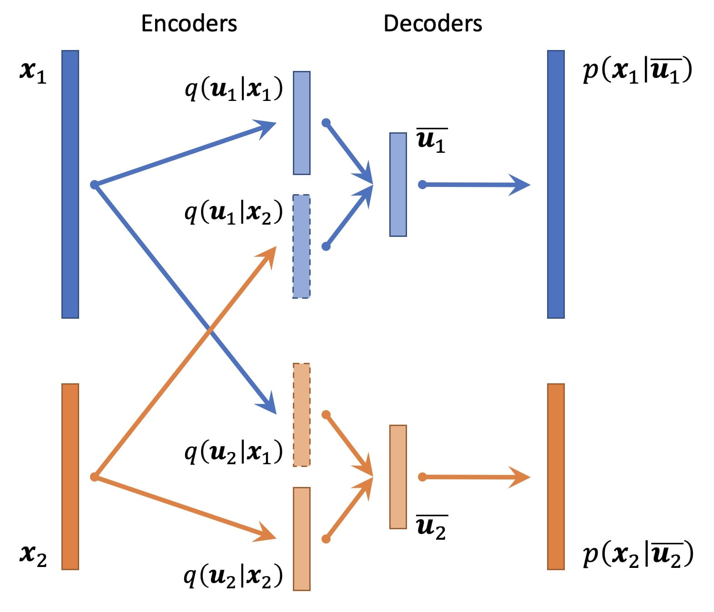

# CLUE (Cross-Linked Unified Embedding)

Team GLUE: Zhi-Jie Cao, Xin-Ming Tu, Chen-Rui Xia

**CLUE** is a semi-supervised single-cell multi-omics integration model. It employs variational autoencoders to project cells from different modalities into a unified low-dimensional embedding space, where modality matching can be performed. Specially, we model data in each modality as generated from a modality-specific subspace of the complete cell embedding. Through a matrix of cross-encoders, CLUE projects cells in each modality into all modality-specific subspaces, which are then concatenated to build a comprehensive embedding, allowing the model to capture both shared and modality-specific information.

**General architecture of CLUE ⤴️**

> CLUE is implemented as part of the `scglue` Python package. A pre-release containing the CLUE model is available as `resources/scglue-0.1.1-py3-none-any.whl`. A formal release will be made available later on PyPI and Anaconda. Stay tuned at [https://github.com/gao-lab/GLUE](https://github.com/gao-lab/GLUE).
