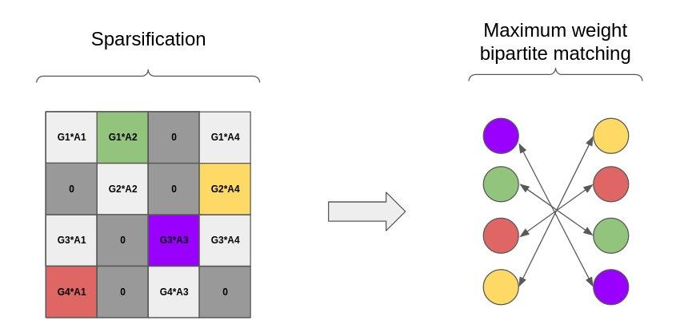

# NeurIPS-Single-Cell-MultiModality

Team Novel: Gleb Ryazantsev, Nikolay Russkikh, Igor I

The approach utilizes sample representations, learned in the same way as in the CLIP model. Encoders for all of the modalities are fully connected, the dimensionality of GEX and ATAC data is reduces via LSI transform (ADT is left as-is). Then, to obtain sample pairings, a maximum weight matching on a bipartite graph is performed, where weights are cosine similarities between sample embeddings.

 
