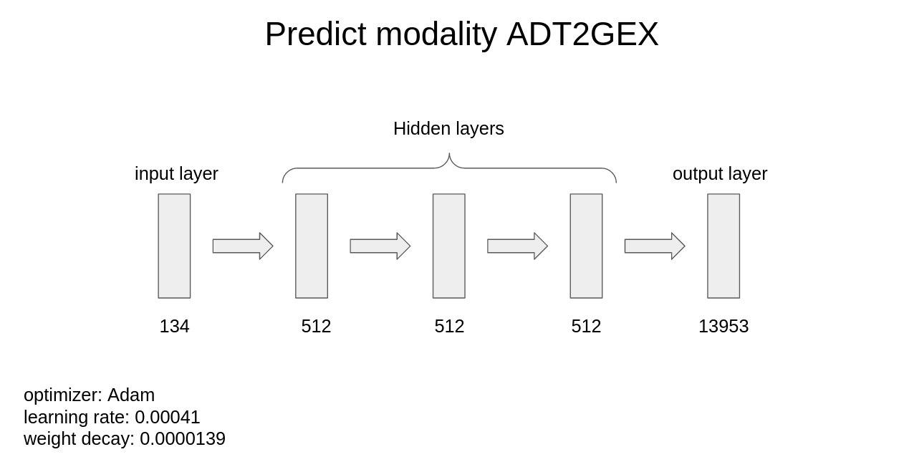

# NeurIPS-Single-Cell-MultiModality

Team Novel: Gleb Ryazantsev, Nikolay Russkikh, Igor I

The task is solved via training encoder-decoder MLP model with one output neuron per  component in the target. As an input, the encoders use representations obtained from ATAC and GEX data via LSI transform and raw ADT data. The hyperparameters of the models were found via broad hyperparameter search using the Optuna framework

